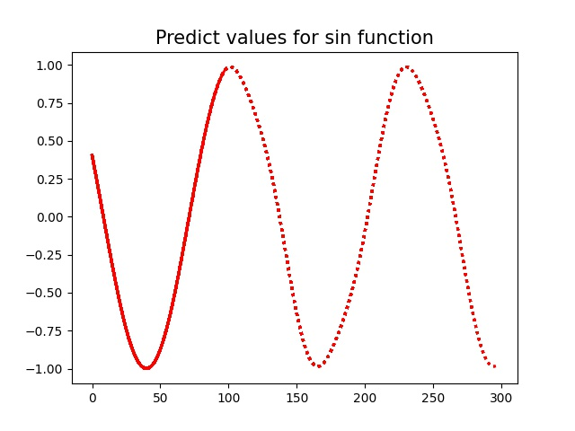

[源仓库](https://github.com/MaXuSun/time_sequence_predict.git)

# 时序预测

使用pytorch实现的一个rnn,用来对sin函数进行预测

# 文件目录
|文件|作用|
|-|:-|
|predict_sin_func.py |源文件|
|rnn.py|该实验用到的RNN|
|data_generator.py|生成实验用的数据的python文件|
|train_raw_data.pt|data_generator.py文件生成的训练用数据|
| cpu_train.py | 使用CPU训练 |
| gpu_train.py | 使用GPU训练 |
|.pkl |训练得到的权重文件|
|predict.py| 预测|

# 开始使用

* 安装Anaconda

* 创建名为rnn的新环境`conda create -n rnn python=3.6`

* 根据requirements.txt安装环境

* 将环境切换到rnn`conda activate rnn`

  ~~~shell
  python data_generator.py # 生成数据文件
  python cpu_train.py # 开始训练
  ~~~

  

# 效果

14次训练效果

预测效果

